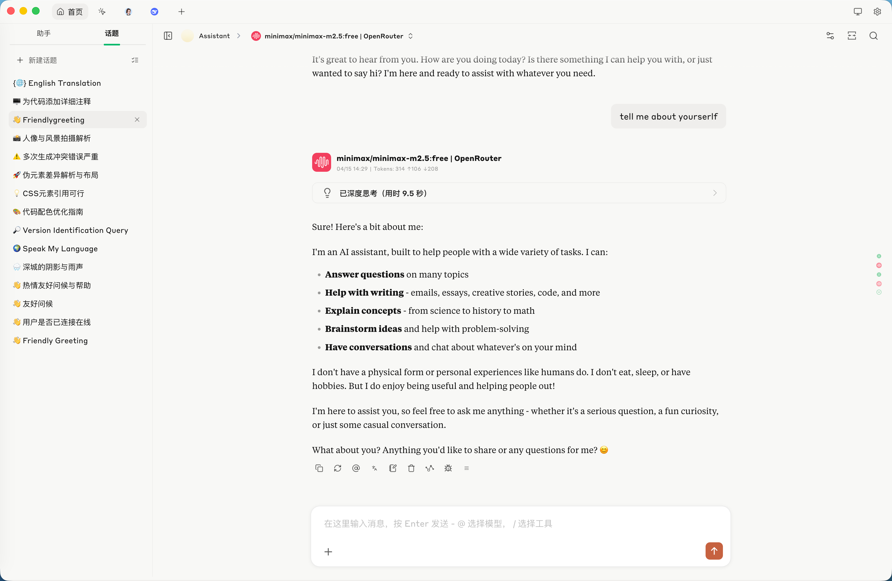
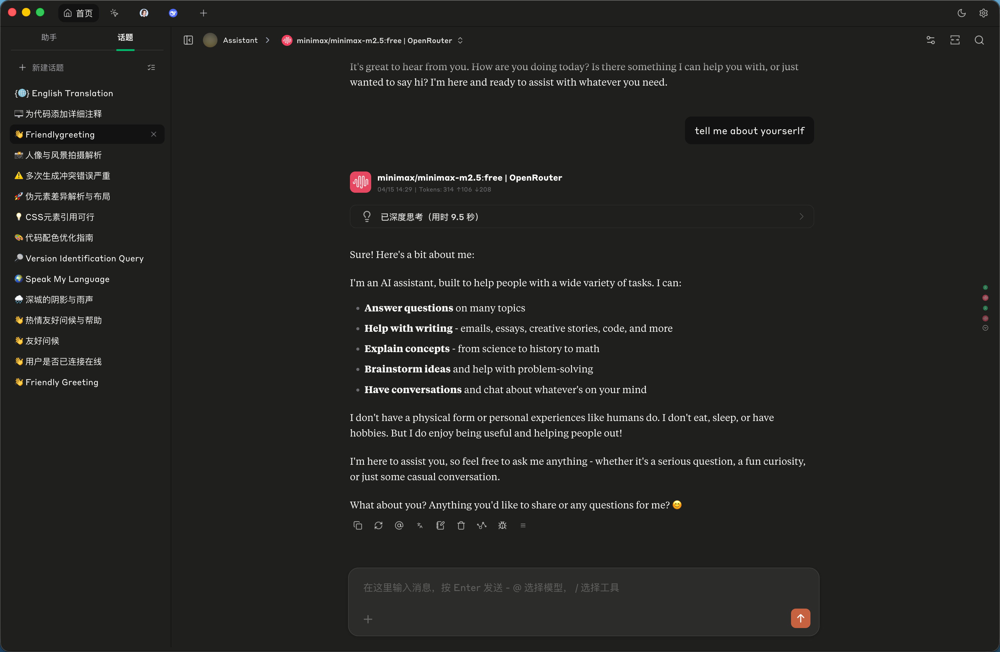

# cherry-studio-claude-style-theme
适用于Cherry Studio的Claude风格主题
Claude Style Theme for Cherry Studio




## 获取最佳效果
1. 下载2个字体（非商用试用版）
   - 非衬线字体：Styrene，https://www.typewolf.com/styrene
   - 衬线字体：Tiempos Text，https://www.typewolf.com/tiempos-text
   - 来源：https://www.typewolf.com/site-of-the-day/claude
2. 将上面的CSS代码粘贴到 Cherry Studio - 设置 - 显示设置 - 自定义CSS
3. Cherry Studio - 设置 - 显示设置 中，还需要设置 导航栏位置 - 顶部， 话题位置 - 左侧
4. 在对话页面，右上角设置 - 消息样式 - 气泡

## To Achieve the Best Results

1. **Download 2 fonts (Non-commercial trial versions):**
   - **Sans-serif:** Styrene, https://www.typewolf.com/styrene
   - **Serif:** Tiempos Text, https://www.typewolf.com/tiempos-text
   - **Source:** https://www.typewolf.com/site-of-the-day/claude

2. **Paste the CSS code** provided above into:
   `Cherry Studio` -> `Settings` -> `Appearance Settings` -> `Custom CSS`

3. **In `Appearance Settings`, configure the following layout options:**
   - **Navigation Bar Position:** Top
   - **Topic Position:** Left

4. **Change the message style:**
   On the chat page, go to the top-right `Settings` -> `Message Style` -> `Bubble`

## Ref
- Based on https://linux.do/t/topic/1052529
- https://github.com/bjl101501/CherryStudio-Claudestyle-dynamic/blob/main/dev.md
- https://github.com/igeekbb/Cherry-Studio-Claude-theme

## CSS Code
```
/* =========================================================
   CherryStudio Custom CSS — Claude Style Theme
   =========================================================

   https://github.com/tungloong/cherry-studio-claude-style-theme

   HOW TO GET THE BEST RESULTS:
   1. INSTALL FONTS (Non-commercial trial versions):
      - Sans-serif: Styrene
        https://www.typewolf.com/styrene
      - Serif: Tiempos Text
        https://www.typewolf.com/tiempos-text
      - Inspiration: https://www.typewolf.com/site-of-the-day/claude
   2. APPLY CUSTOM CSS:
      - Go to: Settings -> Appearance Settings -> Custom CSS
      - Paste this entire code block into the field.
   3. CONFIGURE LAYOUT:
      - Go to: Settings -> Appearance Settings
      - Navigation Bar Position: Top
      - Topic Position: Left
   4. CHANGE MESSAGE STYLE:
      - On the chat page, click the Settings icon in the top-right corner.
      - Message Style: Select "Bubble"
   ========================================================= */

/* Your CSS code starts here */


/* =========================
   1. Claude 调色板（浅色）
   ========================= */
:root {
  --font-family: "Styrene B Trial", system-ui, "Segoe UI", Roboto, Helvetica, Arial, sans-serif;
  --font-family-serif: "Test Tiempos Text", Georgia, "Arial Hebrew", "Noto Sans Hebrew", "Times New Roman", Times, "Hiragino Sans", "Yu Gothic", Meiryo, "Noto Sans CJK JP", "PingFang TC", "Microsoft JhengHei", "Noto Sans CJK TC", "PingFang SC", "Microsoft YaHei", "Noto Sans CJK SC", "Apple SD Gothic Neo", "Malgun Gothic", "Noto Sans CJK KR", serif;
  
  --background: oklch(0.9786 0.0027 106.45);
  --foreground: oklch(0.3438 0.0269 95.7226);
  --card: oklch(0.9818 0.0054 95.0986);
  --card-foreground: oklch(0.1908 0.0020 106.5859);
  --popover: oklch(1 0 0);
  --popover-foreground: oklch(0.2671 0.0196 98.9390);
  --primary: oklch(0.6171 0.1375 39.0427);
  --primary-foreground: oklch(1 0 0);
  --secondary: oklch(0.9484 0.0032 81.39);
  --secondary-foreground: oklch(0.4334 0.0177 98.6048);
  --muted: oklch(0.9341 0.0153 90.2390);
  --muted-foreground: oklch(0.6059 0.0075 97.4233);
  --accent: oklch(0.9245 0.0138 92.9892);
  --accent-foreground: oklch(0.2671 0.0196 98.9390);
  --destructive: oklch(0.1908 0.0020 106.5859);
  --destructive-foreground: oklch(1 0 0);
  --border: oklch(0.8847 0.0069 97.3627);
  --input: oklch(0.7621 0.0156 98.3528);
  --ring: oklch(0.6171 0.1375 39.0427);

  --chart-1: oklch(0.5583 0.1276 42.9956);
  --chart-2: oklch(0.6898 0.1581 290.4107);
  --chart-3: oklch(0.8816 0.0276 93.1280);
  --chart-4: oklch(0.8822 0.0403 298.1792);
  --chart-5: oklch(0.5608 0.1348 42.0584);
  --sidebar: oklch(0.9663 0.0080 98.8792);
  --sidebar-foreground: oklch(0.3590 0.0051 106.6524);
  --sidebar-primary: oklch(0.6171 0.1375 39.0427);
  --sidebar-primary-foreground: oklch(0.9881 0 0);
  --sidebar-accent: oklch(0.9245 0.0138 92.9892);
  --sidebar-accent-foreground: oklch(0.3250 0 0);
  --sidebar-border: oklch(0.9401 0 0);
  --sidebar-ring: oklch(0.7731 0 0);

  --markdown-color: oklch(0.1832 0 89.88);
}


/* =========================
   2. Claude 调色板（深色）
   ========================= */
body[theme-mode="dark"] {
  --background: oklch(0.2388 0.002 106.55);
  --foreground: oklch(0.8074 0.0142 93.0137);
  --card: oklch(0.2679 0.0036 106.6427);
  --card-foreground: oklch(0.9818 0.0054 95.0986);
  --popover: oklch(0.3085 0.0035 106.6039);
  --popover-foreground: oklch(0.9211 0.0040 106.4781);
  --primary: oklch(0.6724 0.1308 38.7559);
  --primary-foreground: oklch(1 0 0);
  --secondary: oklch(0.1822 0 89.88);
  --secondary-foreground: oklch(0.3085 0.0035 106.6039);
  --muted: oklch(0.2213 0.0038 106.7070);
  --muted-foreground: oklch(0.7713 0.0169 99.0657);
  --accent: oklch(0.2130 0.0078 95.4245);
  --accent-foreground: oklch(0.9663 0.0080 98.8792);
  --destructive: oklch(0.6368 0.2078 25.3313);
  --destructive-foreground: oklch(1 0 0);
  --border: oklch(0.3618 0.0101 106.8928);
  --input: oklch(0.4336 0.0113 100.2195);
  --ring: oklch(0.6724 0.1308 38.7559);

  --chart-1: oklch(0.5583 0.1276 42.9956);
  --chart-2: oklch(0.6898 0.1581 290.4107);
  --chart-3: oklch(0.2130 0.0078 95.4245);
  --chart-4: oklch(0.3074 0.0516 289.3230);
  --chart-5: oklch(0.5608 0.1348 42.0584);
  --sidebar: oklch(0.2357 0.0024 67.7077);
  --sidebar-foreground: oklch(0.8074 0.0142 93.0137);
  --sidebar-primary: oklch(0.3250 0 0);
  --sidebar-primary-foreground: oklch(0.9881 0 0);
  --sidebar-accent: oklch(0.1680 0.0020 106.6177);
  --sidebar-accent-foreground: oklch(0.8074 0.0142 93.0137);
  --sidebar-border: oklch(0.9401 0 0);
  --sidebar-ring: oklch(0.7731 0 0);

  --markdown-color: oklch(0.9786 0.0027 106.45);
}


/* =========================
   3. Cherry Studio 变量映射
   ========================= */
body[theme-mode] {
  /* 内容区域 */
  --content-color: var(--foreground);
  --content-bgcolor: var(--background);
  --content-bgcolor-ai: var(--muted);
  --content-bgcolor-soft: var(--secondary);
  --content-bgcolor-soft-soft: var(--accent);
  --content-bgcolor-hard: var(--popover);

  /* 消息与输入 */
  --message-bgcolor: var(--card);
  --input-bgcolor: var(--input);
  --chat-background-user: var(--secondary);
  --color-text: var(--markdown-color);

  /* 思考块 */
  --content-bgcolor-thinking: var(--accent);
  --content-bgcolor-thinking-border: var(--border);
  --thinking-block-bgcolor: var(--accent);

  /* 边框与背景 */
  --border-color: var(--border);
  --color-background: var(--background);
  --color-background-soft: var(--secondary);
  --color-background-mute: var(--muted);
  --modal-background: var(--popover);

  /* 导航栏 */
  --navbar-background: transparent;
  --navbar-background-mac: var(--background);
  --color-list-item: var(--secondary);
}


/* =========================
   4. Ant Design 变量映射
   ========================= */
:root, body[theme-mode] {
  --ant-color-primary: var(--primary);
  --ant-color-link: var(--primary);
  --ant-color-text: var(--foreground);
  --ant-color-text-secondary: var(--muted-foreground);
  --ant-color-border: var(--border);
  --ant-color-split: var(--border);
  --ant-color-bg-layout: var(--background);
  --ant-color-bg-container: var(--card);
  --ant-color-bg-elevated: var(--popover);
  --ant-color-fill: var(--secondary);
  --ant-color-fill-secondary: var(--muted);
}


/* =========================
   5. 聊天区域边界线
   ========================= */

/* 取消圆角，增加左边界线 */
.bubble {
  border-left: 1px solid var(--secondary) !important;
  position: relative;
  border-radius: unset !important;
}

/* =========================
   6. 侧边栏话题列表
   ========================= */

/* 隐藏时间 */
.topics-tab .time,
.draggable-content .time {
  display: none !important;
}

/* 去掉边框/分割线 */
.ant-dropdown-trigger.active {
  border: none !important;
  box-shadow: none !important;
}

/* 列表项内边距与间距 */
.ant-dropdown-trigger.active,
.ant-dropdown-trigger {
  padding: 6px 8px !important;
  margin-bottom: 0px !important;
  margin-top: 0px !important;
}

.draggable-content,
div[data-rfd-draggable-context-id] {
  padding-bottom: 1px !important;
}

/* 字体大小 */
.draggable-content * {
  font-size: 14px;
}

/* 选中态与 hover 态 */
.topics-tab .ant-dropdown-trigger.active,
.topics-tab .ant-dropdown-trigger:hover {
  background-color: var(--secondary) !important;
  border-radius: 8px !important;
}

/* =========================
   7. 聊天气泡
   ========================= */

/* 隐藏用户头像和名称 */
.message-user .message-header {
  display: none !important;
}

/* 消息列表底部留白 */
#messages {
  padding-bottom: 50px !important;
}

/* user字体 */
.message-user .message-content-container {
  font-family: var(--font-family) !important;
  font-size: 16px;
}

/* assistant字体 */
.message-assistant .message-content-container {
  font-family: var(--font-family-serif) !important;
  font-size: 16px;
}


/* =========================
   8. 顶部 Tab 栏
   ========================= */

/* 整个 Tab 列表的内边距 */
.tabs-sortable {
  padding: 4px !important;
}

/* Tab 文本的字体与字号 */
.tabs-sortable span {
  font-family: var(--font-family);
  font-size: 14px;
}

/* Tab 中的 SVG 图标尺寸 */
.tabs-sortable svg {
  width: 15px;
  height: 15px;
}

/* 可交互的按钮区域（Tab 项容器） */
.tabs-sortable div[role="button"] {
  border-radius: 8px !important;
  padding: 2px !important;
  transition: background 0.2s ease, color 0.2s ease;
}

/* 按钮内部的文本/内容容器 */
.tabs-sortable div[role="button"] > div {
  padding: 4px 6px 4px 8px !important;
  min-width: 0 !important;
}

/* 关闭按钮：默认隐藏，hover 显示 */
.tabs-sortable .close-button {
  opacity: 0 !important;
  width: 0 !important;
  padding: 0 !important;
  margin: 0 !important;
  overflow: hidden;
  transition: opacity 0.2s ease, width 0.5s ease, padding 0.2s ease;
}

/* 鼠标悬停在按钮上时，显示关闭按钮 */
.tabs-sortable div[role="button"]:hover .close-button {
  opacity: 1 !important;
  width: 14px !important;
  padding: 0 2px !important;
}


/* 未选中的 Tab：隐藏文字，仅保留图标 */
/* 
   注意这里的动态哈希类名，可能在软件更新后失效
  .dSUkUk 是 Tab 未被选中状态的容器类名
  span.sc-efcRga 是文本标签
*/
.tabs-sortable .dSUkUk span.sc-efcRga {
  opacity: 0 !important;
  max-width: 0 !important;
  transition: opacity 0.2s ease, max-width 0.8s ease;
}

/* hover 时显示文本，并且让 flex 撑开占满剩余空间 */
.tabs-sortable .dSUkUk:hover span.sc-efcRga {
  opacity: 1 !important;
  max-width: 80px !important;
  transition: opacity 0.2s ease, max-width 0.8s ease;
}

/* + 号按钮对齐 */
.tab-scroll-container > div > div:has(.anticon-plus) {
  margin-top: 6px !important;
}

/* Tab 区域的容器底部边框线 */
div:has(.tab-scroll-container) {
  border-bottom-width: 1px;
  border-color: var(--secondary);
}


/* =========================
   9. 输入框
   ========================= */

/* 输入框容器样式 */
.inputbar {
  border-radius: 20px !important;
  padding-left: 12px !important;
  padding-right: 12px !important;
  margin-bottom: 10px !important;
}

/* 输入框文本样式 */
#inputbar textarea {
  font-size: 16px !important;
  font-family: var(--font-family) !important;
  padding: 12px 24px 0px !important;
}

/* 输入框白底和阴影 */
#inputbar {
  background: oklch(0.9993 0 89.88) !important;
  border: 1px solid rgba(0, 0, 0, 0.08) !important;
  box-shadow: 0 1px 6px rgba(0, 0, 0, 0.06) !important;
}

#inputbar:focus-within {
  border-color: rgba(0, 0, 0, 0.15) !important;
  box-shadow: 0 2px 12px rgba(0, 0, 0, 0.08) !important;
}

/* 输入框深色模式 */
body[theme-mode='dark'] #inputbar {
  background: oklch(0.2923 0.002 106.52) !important;
  border: 1px solid rgba(255, 255, 255, 0.08) !important;
  box-shadow: 0 1px 6px rgba(0, 0, 0, 0.2) !important;
}

body[theme-mode='dark'] #inputbar:focus-within {
  border-color: rgba(255, 255, 255, 0.15) !important;
  box-shadow: 0 2px 12px rgba(0, 0, 0, 0.3) !important;
}


/* =========================
   10. 工具栏（+ 号展开）
   ========================= */

/* 默认收起 */
.inputbar-container .ant-dropdown-trigger {
  max-width: 36px !important;
  overflow: hidden !important;
  transition: max-width 0.3s ease !important;
}

/* + 号图标 */
.inputbar-container .ant-dropdown-trigger::before {
  content: '+' !important;
  font-size: 28px !important;
  font-family: var(--font-family) !important;
  font-weight: 300 !important;
  color: #666666 !important;
  display: flex !important;
  align-items: center !important;
  justify-content: center !important;
  min-width: 30px !important;
  height: 30px !important;
  flex-shrink: 0 !important;
  cursor: pointer !important;
  padding: 0px 10px 8px 0px !important;
  margin-left: 6px !important;
}

/* 工具按钮默认隐藏 */
.inputbar-container .ant-dropdown-trigger div[data-rfd-droppable-id] {
  opacity: 0 !important;
  transition: opacity 0.2s ease !important;
}

/* hover 展开 */
.inputbar-container .ant-dropdown-trigger:hover {
  max-width: 1000px !important;
}

/* hover 显示工具按钮 */
.inputbar-container .ant-dropdown-trigger:hover div[data-rfd-droppable-id] {
  opacity: 1 !important;
}


/* =========================
   11. 发送按钮与翻译按钮
   ========================= */

/* 发送按钮容器 */
.inputbar-container div:has(.icon-ic_send) {
  margin-right: 2px;
  margin-bottom: 6px;
}

/* 发送按钮样式 */
i.icon-ic_send {
  background-color: #C6613F !important;
  color: #FFFFFF !important;
  width: 32px !important;
  height: 32px !important;
  border-radius: 8px !important;
  display: flex !important;
  align-items: center !important;
  justify-content: center !important;
  font-size: 0 !important;
  transition: background-color 0.2s ease !important;
  cursor: pointer !important;
}

/* 发送按钮 hover 高亮 */
i.icon-ic_send:hover {
  background-color: #D97757 !important;
}

/* 发送按钮箭头图标 */
i.icon-ic_send::before {
  content: '' !important;
  display: block !important;
  width: 18px !important;
  height: 18px !important;
  background-image: url("data:image/svg+xml,%3Csvg xmlns='http://www.w3.org/2000/svg' viewBox='0 0 256 256' fill='white'%3E%3Cpath d='M208.49,120.49a12,12,0,0,1-17,0L140,69V216a12,12,0,0,1-24,0V69L64.49,120.49a12,12,0,0,1-17-17l72-72a12,12,0,0,1,17,0l72,72A12,12,0,0,1,208.49,120.49Z'/%3E%3C/svg%3E") !important;
  background-size: contain !important;
  background-repeat: no-repeat !important;
  background-position: center !important;
}

/* 翻译按钮：默认隐藏，hover 父容器时显示 */
.inputbar-container button:has(.lucide-languages) {
  opacity: 0 !important;
  transition: opacity 0.2s ease;
}

/* hover 发送按钮区域，显示翻译按钮 */
.inputbar-container div:has(.icon-ic_send):hover > button:has(.lucide-languages) {
  opacity: 1 !important;
}


/* 打断/停止按钮 */
button:has(.lucide-circle-pause) {
  background-color: transparent !important;
  color: #FFFFFF !important;
  width: 32px !important;
  height: 32px !important;
  border-radius: 8px !important;
  border: 1px solid var(--border) !important;
  display: flex !important;
  align-items: center !important;
  justify-content: center !important;
  font-size: 0 !important;
  transition: background-color 0.2s ease !important;
  cursor: pointer !important;
  animation: fadeIn 2s ease-out;
}

@keyframes fadeIn {
  from { opacity: 0; }
  to { opacity: 1; }
}

button:has(.lucide-circle-pause) svg {
  display: none !important;
}

button:has(.lucide-circle-pause):hover {
  background-color: var(--border) !important;
}

/* 默认（浅色模式）用深色图标 */

button:has(.lucide-circle-pause)::before {
  content: '' !important;
  display: block !important;
  width: 18px !important;
  height: 18px !important;
  background-image: url("data:image/svg+xml,%3Csvg xmlns='http://www.w3.org/2000/svg' viewBox='0 0 256 256' fill='%23666666'%3E%3Cpath d='M128,20A108,108,0,1,0,236,128,108.12,108.12,0,0,0,128,20Zm0,192a84,84,0,1,1,84-84A84.09,84.09,0,0,1,128,212Zm40-112v56a12,12,0,0,1-12,12H100a12,12,0,0,1-12-12V100a12,12,0,0,1,12-12h56A12,12,0,0,1,168,100Z'/%3E%3C/svg%3E") !important;
  background-size: contain !important;
  background-repeat: no-repeat !important;
  background-position: center !important;
}

/* 深色模式用白色图标 */
body[theme-mode='dark'] button:has(.lucide-circle-pause)::before {
  background-image: url("data:image/svg+xml,%3Csvg xmlns='http://www.w3.org/2000/svg' viewBox='0 0 256 256' fill='white'%3E%3Cpath d='M128,20A108,108,0,1,0,236,128,108.12,108.12,0,0,0,128,20Zm0,192a84,84,0,1,1,84-84A84.09,84.09,0,0,1,128,212Zm40-112v56a12,12,0,0,1-12,12H100a12,12,0,0,1-12-12V100a12,12,0,0,1,12-12h56A12,12,0,0,1,168,100Z'/%3E%3C/svg%3E") !important;
}

/* =========================
   12. 模型列表栏
   ========================= */

.home-navbar,
.agent-navbar {
  position: relative !important;
  z-index: 10 !important;
}

.home-navbar::after,
.agent-navbar::after {
  content: '' !important;
  position: absolute !important;
  bottom: -40px !important;
  left: 0 !important;
  right: 0 !important;
  height: 40px !important;
  background: linear-gradient(to bottom,
    var(--navbar-background-mac) 0%,
    color-mix(in srgb, var(--navbar-background-mac) 70%, transparent) 30%,
    color-mix(in srgb, var(--navbar-background-mac) 30%, transparent) 60%,
    transparent 100%
  ) !important;
  pointer-events: none !important;
  z-index: 10 !important;
}
```
